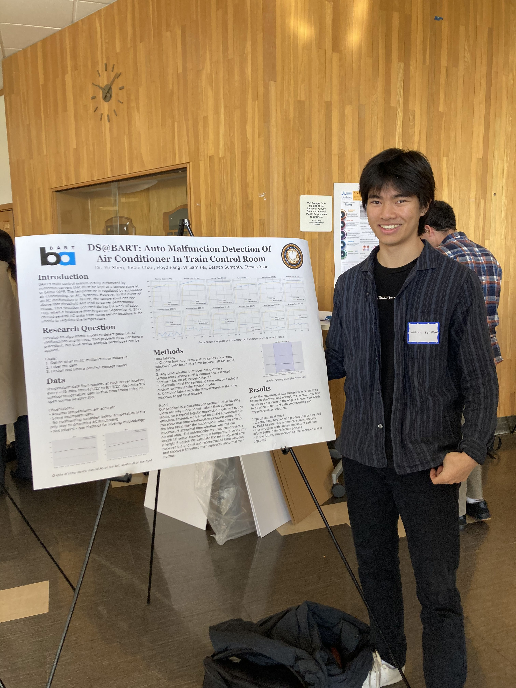

# AC-Monitor

This repository is publicly accessible, with all proprietary source files, data, and sensitive information removed.

## Commit Information

The commit "Final changes" (`ede9ab0`) on the main branch contains the latest presentable content for the showcase.

## Meaningful Artifacts

- `src/notebooks/aclabeler.py`: Defines the `ACLabeler` class.
- `src/notebooks/AC_labeler.ipynb`: Notebook for labeling sample data using `ACLabeler` from `src/notebooks/aclabeler.py`.
- `notebooks/BART-ecg-anomaly-detection.ipynb`: Anomaly detection with autoencoder and LSTM. Also available as `ac_anomaly_detection.py` and `ac_anomaly_detection.ipynb` in the `notebooks` and `scripts` sub-folders during the annotation process.
- `data/tempseries_labeled.zip`: First 3 rows (out of 129,760) of the actual labeled time series data used in `BART-ecg-anomaly-detection.ipynb`.
- `data/labeledtimewindows/labeledtimewindows_ab_yuan.zip`: First five rows of the labels done by Steven Yuan.
- `data/labeledtimewindows/labeledtimewindows_william.zip`: First five rows of the labels done by William Fei.
- `data/labeledtimewindows/labeled_timewindows_conflict_yuanwilliam.zip`: First five rows of the labels done by Floyd, showing conflicts.
- `data/labeledtimewindows_all.zip`: The combination of labels from Steven, William, and Floyd.

## Achievements

- **Runner-up for Data Science Lifecycle Ribbon of Excellence** at Berkeley's Fall 2022 Research Showcase
- Learn more about the [Fall 2022 Showcase](https://data.berkeley.edu/discovery/semester-overviews/fall-2022-overview).
